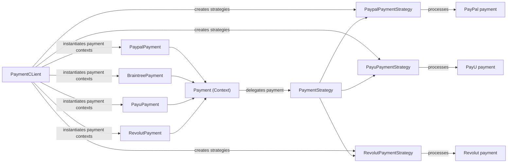
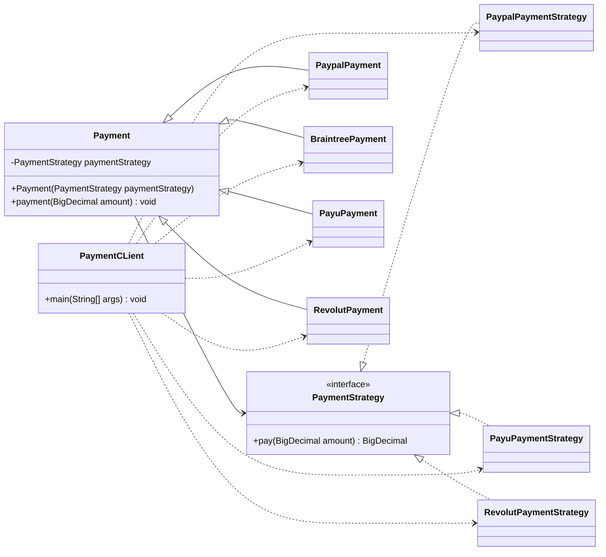


# Strategy Design Pattern - Payment Gateway Module

## Overview
This module demonstrates the Strategy design pattern in a payment-processing example. The pattern allows different payment providers to be selected at runtime without changing the payment flow itself.

In this implementation, the `Payment` class acts as the context. It holds a `PaymentStrategy` object and delegates the actual payment execution to that strategy. Each payment provider, such as PayPal, PayU, or Revolut, is represented by a concrete strategy implementation.

## Problem Solved
When payment behavior varies by provider, a naive solution would involve many conditional statements, such as:

- if provider == PayPal then do PayPal logic
- else if provider == PayU then do PayU logic
- else if provider == Revolut then do Revolut logic

This causes:

- code duplication
- difficult maintenance
- tight coupling between payment logic and business flow
- poor extensibility when new providers are added

The Strategy pattern solves this by separating the payment logic into interchangeable strategy classes while keeping the customer-facing payment process consistent.

## Pattern Structure

### 1. Strategy Interface
`PaymentStrategy` defines the common contract:

```java
public interface PaymentStrategy {
    BigDecimal pay(BigDecimal amount);
}
```

All payment providers must implement this interface.

### 2. Concrete Strategies
The module includes three concrete strategies:

- `PaypalPaymentStrategy`
- `PayuPaymentStrategy`
- `RevolutPaymentStrategy`

Each strategy encapsulates the logic for processing a payment using a specific provider.

Example:

```java
public class PaypalPaymentStrategy implements PaymentStrategy {
    private String email;
    private String password;

    public PaypalPaymentStrategy(String email, String password) {
        this.email = email;
        this.password = password;
    }

    @Override
    public BigDecimal pay(BigDecimal amount) {
        System.out.println("Paying " + amount + " using PayPal.");
        return amount;
    }
}
```

### 3. Context
`Payment` is the context class. It stores a chosen strategy and invokes it:

```java
public class Payment {
    private final PaymentStrategy paymentStrategy;

    public Payment(PaymentStrategy paymentStrategy) {
        this.paymentStrategy = paymentStrategy;
    }

    public void payment(BigDecimal amount) {
        paymentStrategy.pay(amount);
    }
}
```

This means the payment flow (context) is independent of the specific provider implementation.

### 4. Concrete Payment Types
The module defines provider-specific payment classes that extend `Payment`:

- `PaypalPayment`
- `BraintreePayment`
- `PayuPayment`
- `RevolutPayment`

These classes simply pass the appropriate strategy into the base `Payment` class.

Example:

```java
public class PaypalPayment extends Payment {
    public PaypalPayment(PaymentStrategy paymentStrategy) {
        super(paymentStrategy);
    }
}
```

## Runtime Behavior
The client demonstrates how different payment methods are configured using different strategies:

```java
PaymentStrategy paypalPaymentStrategy = new PaypalPaymentStrategy("a@gmail.com", "123456");
PaymentStrategy braintreePaymentStrategy = new PaypalPaymentStrategy("b@gmail.com", "9876543");
PaymentStrategy revolutPaymentStrategy = new RevolutPaymentStrategy("123456789", "1234");
PaymentStrategy payuPaymentStrategy = new PayuPaymentStrategy("1234567@payu.com", "654321");

Payment paypalPayment = new PaypalPayment(paypalPaymentStrategy);
paypalPayment.payment(new BigDecimal("100.00"));

Payment braintreePayment = new BraintreePayment(braintreePaymentStrategy);
braintreePayment.payment(new BigDecimal("200.00"));
```

Notice that Braintree reuses the same PayPal strategy implementation even though it is a different payment method. This is a good example of reusing an existing strategy when two providers share the same behavior or integration pattern.

## Why This Is a Good Strategy Pattern Example
This module follows the core principles of the Strategy pattern:

- same interface for all payment methods
- strategy can be swapped without changing the context
- payment logic is isolated and reusable
- new providers can be added by implementing `PaymentStrategy`
- client code remains simple and maintainable

## Benefits
- Extensibility: add new payment methods without modifying the payment flow
- Maintainability: strategy logic is isolated in dedicated classes
- Reusability: one strategy can be reused across multiple payment types
- Testability: each strategy can be tested independently

## Architecture Diagram



## Low-Level Class Diagram



This low-level diagram shows the exact relationships in the code:

- `PaymentStrategy` is the shared interface.
- Each concrete strategy implements it.
- `Payment` holds a `PaymentStrategy` and delegates execution to it.
- Provider-specific classes (`PaypalPayment`, `PayuPayment`, etc.) inherit from `Payment`.
- `PaymentCLient` composes these objects by creating strategy implementations and passing them into the payment context.

## Summary
The module demonstrates how the Strategy design pattern can be used to model payment providers independently from the common payment execution flow. It keeps the application flexible, maintainable, and easy to extend as new payment systems are introduced.
